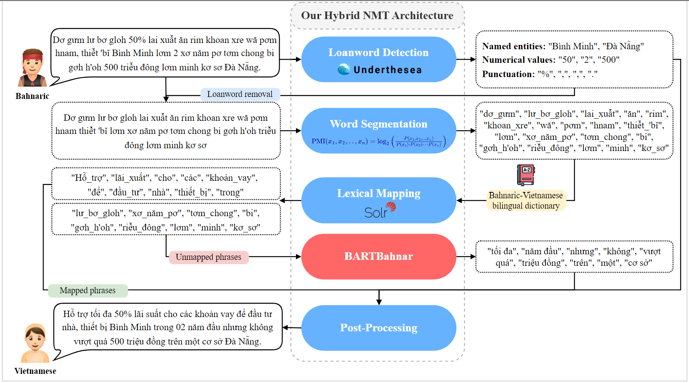

# BARTBahnar

[](LICENSE)
[](https://www.python.org/downloads/release/python-3100/)
[](https://aclanthology.org/2025.lm4uc-1.5/)

A hybrid Bahnaric-Vietnamese machine translation system built on transfer learning from BARTPho, with a PMI-based segmentation pipeline, Solr-backed dictionary lookup, and a suite of low-resource data augmentation methods.

> This repository accompanies the paper:  
> **Serving the Underserved: Leveraging BARTBahnar Language Model for Bahnaric-Vietnamese Translation**  
> Long S. T. Nguyen, Tran T. B. Le, Huong P. N. Nguyen, Quynh T. N. Vo, Phong H. N. Nguyen, Tho T. Quan. Accepted at _LM4UC @ NAACL 2025_.

---

## Table of Contents

- [Why BARTBahnar?](#why-bartbahnar)
- [What's Inside](#whats-inside)
- [Translation Pipeline](#translation-pipeline)
- [BARTBahnar Language Model](#bartbahnar-language-model)
- [Dataset](#dataset)
- [Data Augmentation Methods](#data-augmentation-methods)
- [Results](#results)
- [Installation](#installation)
- [Quickstart](#quickstart)
  - [Running the translation pipeline](#running-the-translation-pipeline)
  - [Running data augmentation](#running-data-augmentation)
- [Apache Solr Setup](#apache-solr-setup)
- [Repository Layout](#repository-layout)
- [References](#references)
- [Citation](#citation)
- [Acknowledgement](#acknowledgement)

---

## Why BARTBahnar?

The Bahnar people are one of Vietnam's 54 ethnic minorities, whose rich cultural heritage is encoded in a language that has virtually no NLP tooling. Bahnaric is extremely low-resource: parallel corpora are scarce, vocabulary coverage is thin, and no prior machine translation system existed before this work.

BARTBahnar addresses this gap through two complementary ideas. First, it exploits a structural advantage: Bahnaric and Vietnamese both belong to the Austroasiatic family, share syntactic patterns, and Bahnaric speakers frequently borrow Vietnamese vocabulary. This makes BARTPho [[1]](#references) — a Vietnamese BART model — an ideal pre-training foundation. Second, rather than betting everything on a neural model with limited data, the system embeds BARTBahnar inside a hybrid pipeline that handles loanwords and common phrases with deterministic methods, reserving the model for genuinely hard cases.

---

## What's Inside

- **Translation pipeline** — a five-stage hybrid system that translates Bahnaric sentences to Vietnamese via loanword detection, PMI-based word segmentation, Solr dictionary lookup, BARTBahnar neural translation, and language-model-guided post-processing.
- **BARTBahnar language model** — an encoder-decoder model derived from BARTPho through three-phase training: Vietnamese pre-training → Bahnaric continual pre-training → bilingual fine-tuning.
- **Data augmentation toolkit** — seven sentence-level augmentation methods (Combine, Swap, Replace by theme, Replace by synonym, Insert, Delete, Sliding Window) designed to diversify low-resource parallel corpora without disrupting semantic fidelity.
- **Bilingual dataset** — 53,942 human-annotated Bahnaric-Vietnamese sentence pairs collected through field surveys, supplemented by 270,587 back-translated pairs.

---

## Translation Pipeline

  
[View full PDF](translation/pipeline.pdf)

The pipeline transforms a raw Bahnaric sentence into Vietnamese through five sequential stages.

**1. Loanword Detection**

Rule-based filtering removes punctuation, special symbols, and numeric characters. A Vietnamese NER model (from Underthesea [[6]](#references)) then identifies proper nouns — place names, personal names — that appear in both languages unchanged. These loanwords bypass translation entirely and are placed directly into the output sentence.

**2. Word Segmentation**

Bahnaric lacks explicit word boundaries, so statistical segmentation is required. The pipeline builds a phrase dictionary from the monolingual Bahnaric corpus using Pointwise Mutual Information (PMI): an $n$-gram qualifies as a valid phrase if it meets both a minimum frequency threshold and a minimum PMI score,

$$
\mathrm{PMI}(x_1, \ldots, x_n) = \log_2 \frac{P(x_1, \ldots, x_n)}{\prod_{i=1}^n P(x_i)}.
$$

The input sentence is then greedily segmented into these dictionary-confirmed phrase units.

**3. Lexical Mapping**

Segmented phrases are looked up in a bilingual Bahnaric-Vietnamese dictionary indexed with Apache Solr [[7]](#references) for fast retrieval. Matched phrases are substituted with their Vietnamese equivalents; unmatched phrases are forwarded to BARTBahnar.

**4. BARTBahnar Translation**

Phrases that could not be resolved by the dictionary are translated by BARTBahnar. When the dictionary returns multiple Vietnamese candidates for a phrase, the post-processing stage selects the most contextually appropriate one using a language model score,

$$
v_c = \underset{v_c \in \{v_{c_1},\ldots,v_{c_k}\}}{\mathrm{argmax}} \; \mathrm{Score}(y_{\text{partial}},\, v_c).
$$

**5. Post-Processing**

The partial translations are assembled into a coherent output sentence. A pre-trained GPT-2 Vietnamese model [[8]](#references) scores candidate assemblies to resolve lexical ambiguities. The module further standardizes capitalization, punctuation, and word order to produce the final translation.

---

## BARTBahnar Language Model

BARTBahnar is trained in three phases that transfer knowledge progressively from high-resource Vietnamese to low-resource Bahnaric.

**Phase 1 — Vietnamese pre-training**  

We start from BARTPho, a BART model pre-trained on 145 million word-segmented Vietnamese sentences with random token masking and sentence shuffling. This phase gives the model a robust grasp of Vietnamese grammar and semantics.

**Phase 2 — Bahnaric continual pre-training**  

BARTPho is further adapted on monolingual Bahnaric text using a masked language modeling objective. The Bahnaric corpus was assembled through extensive field work and digitization — detailed in the [Dataset](#dataset) section below — and then augmented with back-translated text from Vietnamese Wikipedia using the prior Bahnaric-Vietnamese NMT model [[2]](#references).

| Data Source | Sentences |
|---|---|
| Original Bahnaric side | 53,942 |
| Back-Translated (Vietnamese Wikipedia → Bahnaric) | 270,587 |
| **Total** | **324,529** |

**Phase 3 — Bilingual fine-tuning**  
The model is fine-tuned as a standard sequence-to-sequence translator: the encoder takes an unmasked Bahnaric sentence and the decoder generates the Vietnamese translation. Fine-tuning uses only the Original subset (53,942 pairs, optionally augmented with our DA methods) to avoid propagating back-translation noise into the supervised signal. Training runs for 15 epochs with AdamW ($\text{lr}=2\text{e-}5$, $\beta_1=0.9$, $\beta_2=0.999$).

> **Checkpoint** — the released `BartBanaFinal` checkpoint corresponds to Phase 3 above: BARTPho after continual pre-training on the monolingual Bahnaric corpus (Phase 2), then supervised fine-tuned on the Original 53,942 parallel pairs (Phase 3). The checkpoint is stored in `translation/checkpoints/BartBanaFinal/` and tracked with Git LFS — it is included in the repository and clones automatically with `git clone`.

---

## Dataset

The bilingual dataset was compiled over the course of one year through field expeditions to Bahnar-speaking communities across Bình Định, Kon Tum, and Gia Lai provinces. Data was collected from four source types:

- **Field research** — 20 native Bahnar speakers were interviewed to document daily vocabulary and grammar usage.
- **Religious texts** — Bahnaric-language materials obtained from a local church.
- **Broadcast transcripts** — Daily radio bulletins from a regional station serving the Bahnaric-speaking area.
- **Epic literature** — Cultural texts collected from village libraries.

All materials were originally in handwritten or printed form. 50 anonymous contributors digitized and normalized the content, producing a structured dataset with two columns — `Bahnaric` and `Vietnamese` — totalling 53,942 sentence pairs. This Original set was then supplemented with 270,587 back-translated pairs (see [BARTBahnar Language Model](#bartbahnar-language-model) for details).

---

## Data Augmentation Methods

Seven augmentation strategies are implemented in `augmentation/augmentation_methods.py`, all inheriting from a common `AugmentMethods` base class. The framework is language-agnostic and can be applied to any language pair, not just Bahnaric-Vietnamese.

| `METHOD_NUMS` | Method | Class | Description |
|:---:|---|---|---|
| 1 | Combine | `Combine` | Merges pairs of semantically related sentences into longer, more cohesive training examples. |
| 2 | Swap | `SwapSentences` | Reorders sentence segments within compound sentences to expose the model to varied syntactic patterns. |
| 3 | Replace (theme) | `ReplaceWithSameThemes` | Substitutes words with thematically related alternatives using POS-tagged dictionary entries. |
| 4 | Replace (synonym) | `ReplaceWithSameSynonyms` | Substitutes words with synonyms, the single most effective augmentation in our experiments. |
| 5 | Insert | `RandomInsertion` | Inserts thematic words (locations, time references) at clause boundaries to add contextual cues. |
| 6 | Delete | `RandomDeletion` | Removes non-essential words to train robustness against incomplete source sentences. |
| 7 | Sliding Window | `SlidingWindows` | Extracts overlapping sub-sequences of configurable length to increase coverage of local and long-range patterns. |

---

## Results

### BARTBahnar vs. Baselines

All models are fine-tuned on the Original dataset (90/10 train/test split, 53,942 pairs) and evaluated using BLEU and METEOR.

| Model | BLEU ↑ | METEOR ↑ |
|---|---|---|
| Transformer [[5]](#references) | 0.26 | 0.0431 |
| PhoBERT-Fused NMT [[3]](#references) | 2.05 | 0.2648 |
| ViT5 [[4]](#references) | 7.18 | 0.2386 |
| BARTPho [[1]](#references) | 5.73 | 0.2076 |
| **BARTBahnar** | **10.41** | **0.2822** |

### Effect of Data Augmentation on the Full Pipeline

The table below shows how each augmentation method affects translation quality when the augmented data is used to fine-tune the full pipeline. All runs use the same BARTBahnar backbone and evaluation protocol as above.

| DA Method | BLEU ↑ | METEOR ↑ |
|---|---|---|
| No augmentation (baseline) | 10.41 | 0.2822 |
| Insert + Swap | 7.56 | 0.1905 |
| Insert + Original | 12.18 | 0.2921 |
| Swap | 13.74 | 0.2758 |
| Sliding Window | 16.37 | 0.2640 |
| Combine | 16.63 | 0.3170 |
| Delete | 19.45 | **0.3323** |
| Replace (theme) | 20.19 | 0.3210 |
| **Replace (synonym)** | **21.68** | **0.3459** |

Synonym replacement delivers the largest single-method gain — over 2× the BLEU of the non-augmented baseline — by broadening vocabulary coverage without disrupting sentence structure. Combining noising methods (Insert + Swap) hurts performance, confirming that excessive structural perturbation is harmful in low-resource settings.

---

## Installation

**1. Create and activate the conda environment**

```bash
conda create -n bartbahnar python=3.10 -y
conda activate bartbahnar
```

**2. Install dependencies**

Each module has its own dependency set.

*Translation pipeline*

```bash
cd translation
pip install -r requirements.txt
```

*Augmentation toolkit*

```bash
cd augmentation
pip install -r requirements.txt
```

The following data files (including the BARTBahnar checkpoint) are included in the repository and require no setup after cloning:

```
translation/
└── checkpoints/
    └── BartBanaFinal/     # BARTBahnar checkpoint (~1.5 GB, tracked with Git LFS)
data/
├── dictionary/
│   └── bavi.csv               # Bilingual dictionary — columns: Bahnaric, Vietnamese
├── corpus/
│   ├── bahnaric.txt          # Monolingual Bahnaric sentences, one per line
│   └── vietnamese_words.txt  # Vietnamese word list — one word per line
```

To use your own data, replace these files or update the paths in `translation/config.py`.

Also requires a running Apache Solr instance — see [Apache Solr Setup](#apache-solr-setup) below.

---

## Quickstart

### Running the translation pipeline

Make sure Solr is running (see [Apache Solr Setup](#apache-solr-setup)) and the conda environment is active, then:

```bash
conda activate bartbahnar
cd translation
python main.py
```

All three models and the Solr URL are pre-configured with local defaults. Override any of them with flags:

```bash
python main.py \
  --translator_model checkpoints/BartBanaFinal \
  --classification_model undertheseanlp/vietnamese-ner-v1.4.0a2 \
  --best_candidate_model NlpHUST/gpt2-vietnamese \
  --solr_url http://localhost:8983/solr/mycore
```

The pipeline loads all three models once at startup, then reads sentences interactively from stdin.

**Default models**

| Role | Default checkpoint |
|---|---|
| Translation | `translation/checkpoints/BartBanaFinal` (local) |
| NER / Loanword detection | `undertheseanlp/vietnamese-ner-v1.4.0a2` |
| Candidate selection | `NlpHUST/gpt2-vietnamese` |

**Example session**

```
Enter a sentence to translate: Sở nông nghiệp păng tơ iung pơ lei, hơ kom , pơ tâng tỉnh, bộ nông nghiệp păng tơ iung pơ lei a droi ko năr 25/5 dôm khei păng pơ tâng ră kơ tă ah đei a thay.

Final Translated Sentence: Sở nông nghiệp và phát triển nông thôn; tổng hợp, tuyên truyền tinh, bộ nông nghiệp và ptnt trước ngày 25/5 các tháng và báo cáo đột xuất khi có yêu cầu.

Enter a sentence to translate: exit
Exiting the program. See you next time!
```

> **Notes**
> - Use Ctrl+C to force-stop the script at any time.
> - Solr must be running before starting the pipeline.

### Running data augmentation

> The augmentation toolkit is language-agnostic — it works on any parallel corpus. Set `LANG_SOURCE` and `LANG_TARGET` to match your own language pair column names. The translation pipeline, on the other hand, is built specifically for Bahnaric-Vietnamese.

Open `augmentation/run_augmentation.py` and set the config block at the top of the file:

```python
INPUT_PATH = '../data/raw/train.csv'        # Bahnaric-Vietnamese parallel corpus (included in repo)
DICTIONARY_PATH = 'path/to/your/dict.csv'  # thematic dictionary — see Input files below
LANG_SOURCE = 'Bahnaric'
LANG_TARGET = 'Vietnamese'
METHOD_NUMS = 1   # single method: integer 1–7
# METHOD_NUMS = [1, 6, 7]  # or a list to run and combine several methods
```

Then run:

```bash
cd augmentation
python run_augmentation.py
```

**Input files**

| File | Required by | Format |
|---|---|---|
| `INPUT_PATH` | all methods | CSV — two columns named exactly `LANG_SOURCE` and `LANG_TARGET` |
| `DICTIONARY_PATH` | methods 3, 4, 5 only | CSV — columns `LANG_SOURCE`, `LANG_TARGET`, `pos`, and `theme` (method 5 filters on `theme`) |

The Bahnaric-Vietnamese parallel corpus (`data/raw/train.csv`) is included in the repo and works out of the box as `INPUT_PATH`. For other language pairs, replace it with your own parallel corpus and update `LANG_SOURCE`/`LANG_TARGET` to match your column headers.

> `DICTIONARY_PATH` is a thematic/POS-tagged dictionary — not the same as the bilingual lookup dictionary (`data/dictionary/bavi.csv`). It is not included in the repo and must be prepared separately. Required columns:

| Column | Description | Example |
|---|---|---|
| `LANG_SOURCE` | Source-language word | `kơ măng` |
| `LANG_TARGET` | Target-language word | `buổi tối` |
| `pos` | Part of speech | `noun`, `verb`, `adj` |
| `theme` | Semantic theme (method 5 only) | `time`, `place` |

If you do not have this file, methods 3, 4, and 5 cannot be run. Methods 1, 2, 6, and 7 only need `INPUT_PATH`.

**Configuration variables**

| Variable | Affects | Description |
|---|---|---|
| `LANG_SOURCE` | all | Source language column name |
| `LANG_TARGET` | all | Target language column name |
| `BATCH_SIZE` | Combine (1) | Number of sentences per batch when merging |
| `LIMIT_NEW_SENTENCES` | Replace (3, 4) | Max new sentences generated per original |
| `NUM_INSERTIONS` | Insert (5) | Number of words inserted per sentence |
| `MAX_LINES_GENERATED` | Insert (5) | Cap on total output lines |
| `NUM_DELETIONS` | Delete (6) | Number of words removed per sentence |
| `WINDOW_SIZE` | Sliding Window (7) | Size of the sliding window |
| `METHOD_NUMS` | all | Integer 1–7, or a list such as `[1, 6, 7]` to combine multiple methods |

Augmented output is saved to the `augmentation/output/` directory.

---

## Apache Solr Setup

The lexical mapping stage (Stage 3) relies on Apache Solr for fast phrase lookup against the bilingual dictionary. Follow the steps below to set up a local Solr instance before running the pipeline.

**1. Download and extract**

Download the latest release from [https://solr.apache.org/downloads.html](https://solr.apache.org/downloads.html) and extract it:

```bash
tar -xzf solr-9.x.x.tgz
```

**2. Start Solr**

```bash
/path/to/solr-9.x.x/bin/solr start -p 8983
```

Solr runs on port 8983 by default. Open [http://localhost:8983/solr](http://localhost:8983/solr) to verify.

**3. Create a dedicated core**

```bash
/path/to/solr-9.x.x/bin/solr create -c mycore
```

The core URL `http://localhost:8983/solr/mycore` is the value configured in `translation/config.py` as `SOLR_URL` and passed via `--solr_url`.

**4. Stop Solr**

```bash
/path/to/solr-9.x.x/bin/solr stop
```

> **Note** — if Solr is not running when the pipeline starts, the lexical mapping stage is automatically skipped and all phrases are forwarded directly to BARTBahnar. A warning is printed to stderr.

---

## Repository Layout

The repository is organized as follows.

```
BARTBahnar/
├── translation/
│   ├── main.py                       # Entry point; argument parsing and main loop
│   ├── translation_pipeline.py       # Translator class orchestrating all five stages
│   ├── config.py                     # Paths to dictionary, corpus, word list, and checkpoint
│   ├── checkpoints/
│   │   └── BartBanaFinal/            # BARTBahnar checkpoint (~1.5 GB, tracked with Git LFS)
│   └── utils/
│       ├── vietnamese_text_analyzer.py   # Loanword detection and NER (VietnameseTextAnalyzer)
│       ├── word_segmentation.py          # PMI-based phrase extraction and segmentation
│       ├── search.py                     # Solr dictionary lookup (SearchTranslator)
│       ├── translator.py                 # BARTBahnar wrapper (TranslateModel)
│       ├── best_candidate.py             # GPT-2 scoring for candidate selection
│       ├── reconstruct_sentence.py       # Sentence assembly and post-processing
│       └── data_processor.py            # Data loading and cleaning utilities
├── augmentation/
│   ├── augmentation_methods.py       # All augmentation classes (AugmentMethods + subclasses)
│   └── run_augmentation.py           # Configuration and runner script
└── data/
    ├── dictionary/
    │   └── bavi.csv                  # Bilingual Bahnaric-Vietnamese dictionary
    ├── corpus/
    │   ├── bahnaric.txt              # Monolingual Bahnaric corpus (for PMI segmentation)
    │   └── vietnamese_words.txt      # Vietnamese word list (for loanword detection)
    └── raw/
        └── train.csv                 # Raw bilingual training data
```

---

## References

[1] N. L. Tran, D. M. Le, and D. Q. Nguyen. "BARTpho: Pre-trained Sequence-to-Sequence Models for Vietnamese". *INTERSPEECH*, 2022.

[2] H. N. K. Vo, D. D. Le, T. M. D. Phan, T. S. Nguyen, Q. N. Pham, N. O. Tran, Q. D. Nguyen, T. M. H. Vo, and T. Quan. "Revitalizing Bahnaric Language through Neural Machine Translation: Challenges, Strategies, and Promising Outcomes". *AAAI*, 2024.

[3] J. Zhu, Y. Xia, L. Wu, D. He, T. Qin, W. Zhou, H. Li, and T. Liu. "Incorporating BERT into Neural Machine Translation". *ICLR*, 2020.

[4] L. Phan, H. Tran, H. Nguyen, and T. H. Trinh. "ViT5: Pretrained Text-to-Text Transformer for Vietnamese Language Generation". *NAACL (Student Research Workshop)*, pp. 136–142, 2022.

[5] A. Vaswani, N. Shazeer, N. Parmar, J. Uszkoreit, L. Jones, A. N. Gomez, Ł. Kaiser, and I. Polosukhin. "Attention Is All You Need". *NeurIPS*, vol. 30, 2017.

[6] Underthesea — Vietnamese NLP toolkit. https://github.com/undertheseanlp/underthesea

[7] Apache Solr — open-source enterprise search platform. https://solr.apache.org/

[8] GPT-2 Vietnamese — Pretrained GPT model on Vietnamese language. https://huggingface.co/NlpHUST/gpt2-vietnamese

---

## Citation

If you use BARTBahnar in your work, please cite our paper:

```bibtex
@inproceedings{nguyen-etal-2025-serving,
    title = "Serving the Underserved: Leveraging {BARTB}ahnar Language Model for Bahnaric-{V}ietnamese Translation",
    author = "Nguyen, Long  and
      Le, Tran  and
      Nguyen, Huong  and
      Vo, Quynh  and
      Nguyen, Phong  and
      Quan, Tho",
    editor = "Truong, Sang  and
      Putri, Rifki Afina  and
      Nguyen, Duc  and
      Wang, Angelina  and
      Ho, Daniel  and
      Oh, Alice  and
      Koyejo, Sanmi",
    booktitle = "Proceedings of the 1st Workshop on Language Models for Underserved Communities (LM4UC 2025)",
    month = may,
    year = "2025",
    address = "Albuquerque, New Mexico",
    publisher = "Association for Computational Linguistics",
    url = "https://aclanthology.org/2025.lm4uc-1.5/",
    doi = "10.18653/v1/2025.lm4uc-1.5",
    pages = "32--41",
    ISBN = "979-8-89176-242-8",
    abstract = "The Bahnar people, one of Vietnam{'}s ethnic minorities, represent an underserved community with limited access to modern technologies. Developing an effective Bahnaric-Vietnamese translation system is essential for fostering linguistic exchange, preserving cultural heritage, and empowering local communities by bridging communication barriers. With advancements in Artificial Intelligence (AI), Neural Machine Translation (NMT) has achieved remarkable success across various language pairs. However, the low-resource nature of Bahnaric, characterized by data scarcity, vocabulary constraints, and the lack of parallel corpora, poses significant challenges to building an accurate and efficient translation system. To address these challenges, we propose a novel hybrid architecture for Bahnaric-Vietnamese translation, with BARTBahnar as its core language model. BARTBahnar is developed by continually training a pre-trained Vietnamese model, BARTPho, on augmented monolingual Bahnaric data, followed by fine-tuning on bilingual datasets. This transfer learning approach reduces training costs while effectively capturing linguistic similarities between the two languages. Additionally, we implement advanced data augmentation techniques to enrich and diversify training data, further enhancing BARTBahnar{'}s robustness and translation accuracy. Beyond leveraging the language model, our hybrid system integrates rule-based and statistical methods to improve translation quality. Experimental results show substantial improvements on bilingual Bahnaric-Vietnamese datasets, validating the effectiveness of our approach for low-resource translation. To support further research, we open-source our code and related materials at https://github.com/ura-hcmut/BARTBahnar."
}
```

---

## Acknowledgement

This research is funded by Vietnam Ministry of Science and Technology under the Program "Supporting Research, Development, and Technology Application of Industry 4.0" (KC-4.0/19-25), via the project "Development of a Vietnamese-Bahnaric Machine Translation and Bahnaric Text-to-Speech System (All Dialects)" (KC-4.0-29/19-25).
